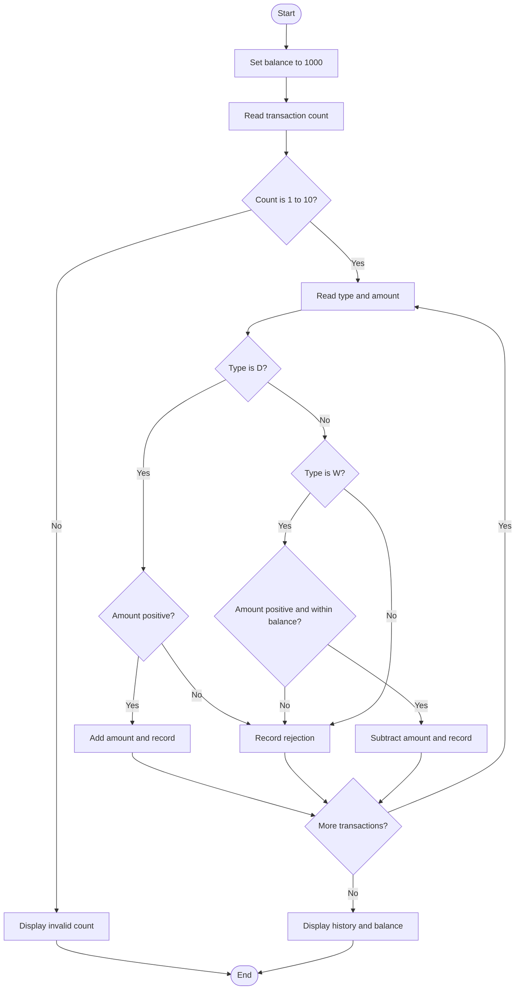

# Flowchart — Case Study 02: ATM Transaction Sequence Simulation

The flowchart is provided in Mermaid notation.

```mermaid
flowchart TD
 A([Start]) --> B[Set balance to 1000]
 B --> C[Read transaction count]
 C --> D{Count is 1 to 10?}
 D -- No --> E[Display invalid count]
 E --> Z([End])
 D -- Yes --> F[Read type and amount]
 F --> G{Type is D?}
 G -- Yes --> H{Amount positive?}
 H -- Yes --> I[Add amount and record]
 H -- No --> J[Record rejection]
 G -- No --> K{Type is W?}
 K -- Yes --> L{Amount positive and within balance?}
 L -- Yes --> M[Subtract amount and record]
 L -- No --> J
 K -- No --> J
 I --> N{More transactions?}
 J --> N
 M --> N
 N -- Yes --> F
 N -- No --> O[Display history and balance]
 O --> Z
```
