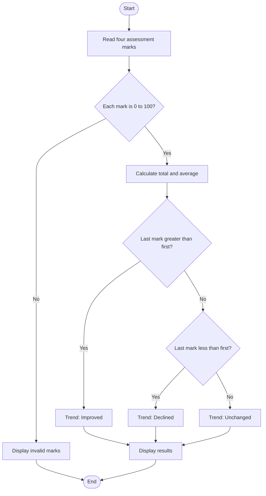

# Flowchart — Case Study 03: Student Performance Trend Analysis

The flowchart is provided in Mermaid notation.

```mermaid
flowchart TD
 A([Start]) --> B[Read four assessment marks]
 B --> C{Each mark is 0 to 100?}
 C -- No --> D[Display invalid marks]
 D --> Z([End])
 C -- Yes --> E[Calculate total and average]
 E --> F{Last mark greater than first?}
 F -- Yes --> G[Trend: Improved]
 F -- No --> H{Last mark less than first?}
 H -- Yes --> I[Trend: Declined]
 H -- No --> J[Trend: Unchanged]
 G --> K[Display results]
 I --> K
 J --> K
 K --> Z
```
