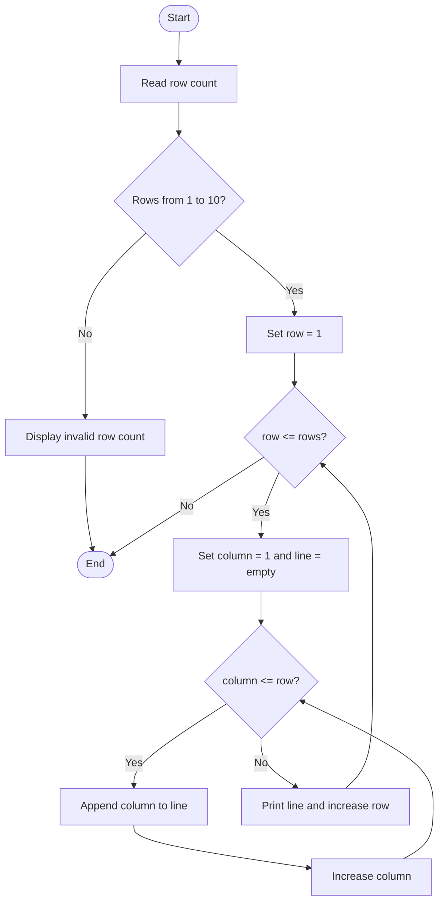

# Flowchart — Case Study 04: Numeric Pattern Generator

```mermaid
flowchart TD
 A([Start]) --> B[Read row count]
 B --> C{Rows from 1 to 10?}
 C -- No --> D[Display invalid row count]
 D --> Z([End])
 C -- Yes --> E[Set row = 1]
 E --> F{row <= rows?}
 F -- No --> Z
 F -- Yes --> G[Set column = 1 and line = empty]
 G --> H{column <= row?}
 H -- Yes --> I[Append column to line]
 I --> J[Increase column]
 J --> H
 H -- No --> K[Print line and increase row]
 K --> F
```
