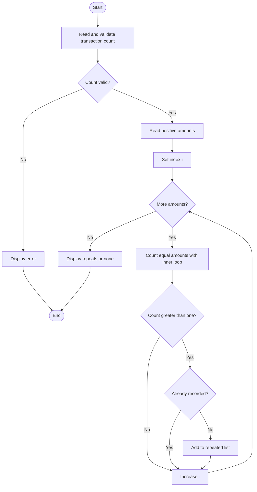

# Flowchart — Case Study 05: Repeated Transaction Detection

```mermaid
flowchart TD
 A([Start]) --> B[Read and validate transaction count]
 B --> C{Count valid?}
 C -- No --> D[Display error]
 D --> Z([End])
 C -- Yes --> E[Read positive amounts]
 E --> F[Set index i]
 F --> G{More amounts?}
 G -- No --> M[Display repeats or none]
 M --> Z
 G -- Yes --> H[Count equal amounts with inner loop]
 H --> I{Count greater than one?}
 I -- No --> L[Increase i]
 I -- Yes --> J{Already recorded?}
 J -- No --> K[Add to repeated list]
 J -- Yes --> L
 K --> L
 L --> G
```
