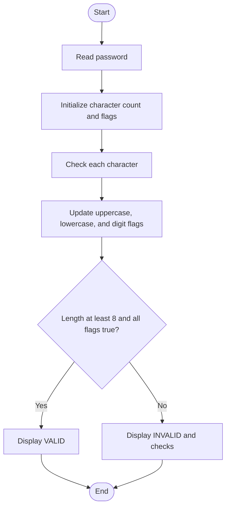

# Flowchart — Case Study 06: Password Policy Validation

```mermaid
flowchart TD
 A([Start]) --> B[Read password]
 B --> C[Initialize character count and flags]
 C --> D[Check each character]
 D --> E[Update uppercase, lowercase, and digit flags]
 E --> F{Length at least 8 and all flags true?}
 F -- Yes --> G[Display VALID]
 F -- No --> H[Display INVALID and checks]
 G --> Z([End])
 H --> Z
```
