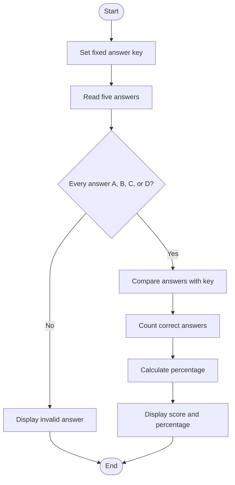

# Flowchart — Case Study 07: String-Based Examination Answer Evaluation

```mermaid
flowchart TD
 A([Start]) --> B[Set fixed answer key]
 B --> C[Read five answers]
 C --> D{Every answer A, B, C, or D?}
 D -- No --> E[Display invalid answer]
 E --> Z([End])
 D -- Yes --> F[Compare answers with key]
 F --> G[Count correct answers]
 G --> H[Calculate percentage]
 H --> I[Display score and percentage]
 I --> Z
```
