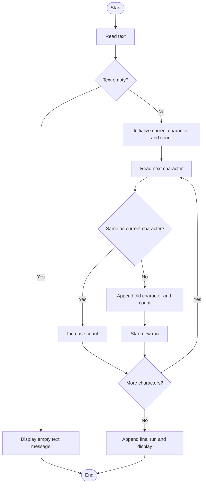

# Flowchart — Case Study 08: Text Compression Using Character Runs

```mermaid
flowchart TD
 A([Start]) --> B[Read text]
 B --> C{Text empty?}
 C -- Yes --> D[Display empty text message]
 D --> Z([End])
 C -- No --> E[Initialize current character and count]
 E --> F[Read next character]
 F --> G{Same as current character?}
 G -- Yes --> H[Increase count]
 G -- No --> I[Append old character and count]
 I --> J[Start new run]
 H --> K{More characters?}
 J --> K
 K -- Yes --> F
 K -- No --> L[Append final run and display]
 L --> Z
```
