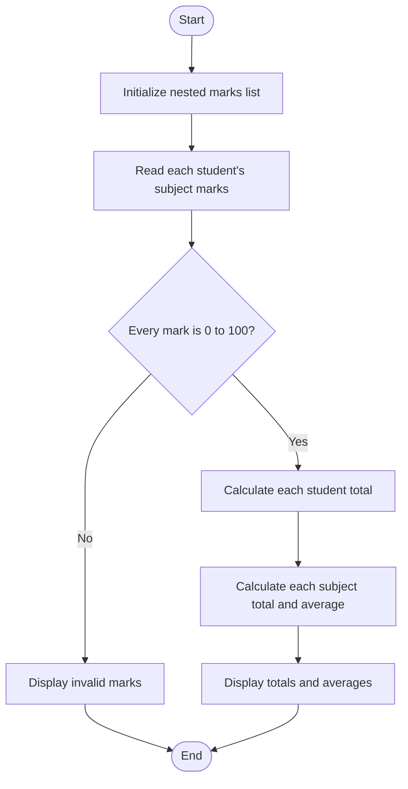

# Flowchart — Case Study 09: Student Marks Matrix Analysis

```mermaid
flowchart TD
 A([Start]) --> B[Initialize nested marks list]
 B --> C[Read each student's subject marks]
 C --> D{Every mark is 0 to 100?}
 D -- No --> E[Display invalid marks]
 E --> Z([End])
 D -- Yes --> F[Calculate each student total]
 F --> G[Calculate each subject total and average]
 G --> H[Display totals and averages]
 H --> Z
```
