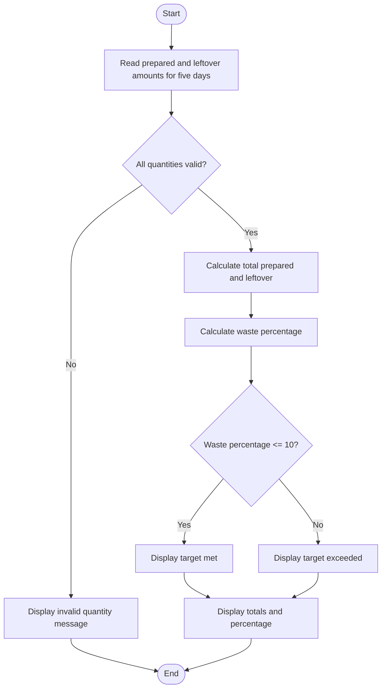

# Flowchart — Case Study 10: Food Waste Monitoring System

```mermaid
flowchart TD
 A([Start]) --> B[Read prepared and leftover amounts for five days]
 B --> C{All quantities valid?}
 C -- No --> D[Display invalid quantity message]
 D --> Z([End])
 C -- Yes --> E[Calculate total prepared and leftover]
 E --> F[Calculate waste percentage]
 F --> G{Waste percentage <= 10?}
 G -- Yes --> H[Display target met]
 G -- No --> I[Display target exceeded]
 H --> J[Display totals and percentage]
 I --> J
 J --> Z
```
